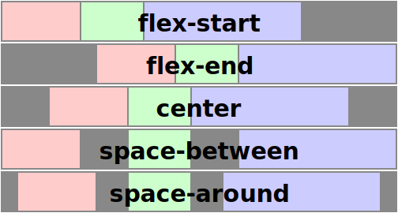
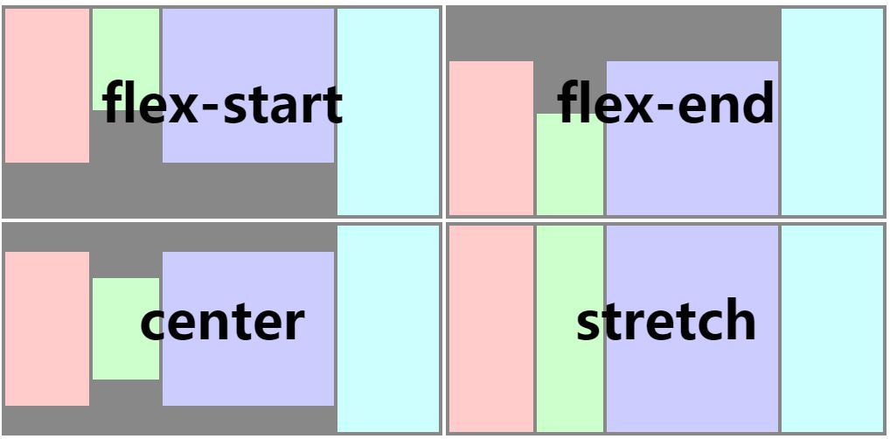

# Common Style
<span class="weex-version">0.4</span>
<a href="https://github.com/weexteam/article/issues/23"  class="weex-translate">cn</a>

All of weex tags share some common style rules

## Box Model


Weex box model based on the CSS box model, all of weex elements can be considered as boxes.  The term "box model" is used when talking about design and layout. The box model is essentially a box that wraps around every HTML element. It consists of margins, borders, paddings, and the actual content.

you can use the definition below in weex box model.

- width
- height
- padding (space around content, between element content and the element border)
  - padding-left
  - padding-right
  - padding-top
  - padding-bottom
- margin (space around elements, outside the border)
  - margin-left
  - margin-right
  - margin-top
  - margin-bottom
- border
  - border-style(solid,dashed,dotted)
  - border-width
    - border-left-width
    - border-top-width
    - border-right-width
    - border-bottom-width
  - border-color
    - border-left-color
    - border-top-color
    - border-right-color
    - border-bottom-color
  - border-radius  ( rounded borders to elements , default value is 0 meaning right angle )
    - border-bottom-left-radius
    - border-bottom-right-radius
    - border-top-left-radius
    - border-top-right-radius

Notes: The rule of border-radius for a specific corner such as `border-top-left-radius` is not currently supported for component `<image>` and `<text>`.

Weex box model uses `border-box` as the default value of `box-sizing`, meaning the width and height properties includes content, padding and border, but not the margin.

example:

```html
<template>
  <div>
    <image src="..." style="width: 400; height: 200; margin-left: 20;"></image>
  </div>
</template>
```

## Flexbox

Weex box style model based on the CSS flexbox, ensures that elements behave predictably and the page layout can accommodates to different screen sizes and different display devices.

Flexbox consists of flex containers and flex items. If a weex element can containing other elements, it is a flex container.

Notice that the old version of flexbox specification has differences with the new ones, such as whether or not to support wrapping. This is described at w3c's working drafts, and you should notice the differences among them. Also notice that the old version is only supported below the 4.4 version of android.

### Flex container

Flexbox is the default and only style model in Weex, so you don't have to add `display: flex;` in a container.

- `flex-direction`: `row` | `column`

The flex-direction property specifies the direction of the flexible items inside the flex container. Default value is `column` (top-to-bottom).

- `justify-content`: `flex-start` | `flex-end` | `center` | `space-between`

The justify-content property horizontally aligns the flexible container's items when the items do not use all available space on the main-axis. Default value is `flex-start` meaning the flex items are positioned at the beginning of the container. `flex-end` means the items are positioned at the end of the container. `center` means the items are positioned at the center of the container. `space-between` means the items are positioned with space between the lines.



- `align-items`: `stretch` | `flex-start` | `center` | `flex-end`

The align-items property vertically aligns the flexible container's items when the items do not use all available space on the cross-axis. Default value is `stretch` meaning the items are stretched to fit the container. `flex-start` means the items are positioned at the top of the container; `flex-end` means the items are positioned at the bottom of the container; `center` means items are positioned at the center of the container (vertically).



### Flex item

- flex : &lt;number&gt;

the flex property specifies the length of the flex item, relative to the rest of the flex items inside the same container.  If all of the flex items set `flex: 1`, they will have equal width or height on direction of flex container's `flex-direction`. If there are two flex items, with one setting `flex: 1`, and the other setting `flex: 2`, the first one will take 1/3 container space, and the second one will take 2/3 container space. If all of flex items don't set `flex`, they will be aligned depending on the container's `justify-content` property.


## Examples

a list of images with equal scales align at the vertical axis:

```html
<template>
  <div style="width: 300; height: 100;">
    <image src="..." style="flex: 1;"></image>
    <image src="..." style="flex: 1;"></image>
    <image src="..." style="flex: 1;"></image>
  </div>
</template>
```

a image with fixed width aligns with a stretched text:

```html
<template>
  <div style="width: 300; height: 100;">
    <image src="..." style="width: 100; height: 100;"></image>
    <text style="flex: 1;">...</text>
  </div>
</template>
```

mixed direction alignment:

```html
<template>
  <div style="width: 100;">
    <image src="..." style="width: 100; height: 100;"></image>
    <div style="flex-direction: row;">
      <text style="flex: 2; font-size: 32;">title</text>
      <text style="flex: 1; font-size: 16;">$100</text>
    </div>
  </div>
</template>
```

one text align left , the other float right:


```html
<template>
<div style="flex-direction: row; justify-content: space-between;">
   <text>WEEX</text>
   <text>2016-05-08</text>
</div>
</template>
```

## Position

we can use properties below to control placement of weex tag

- `position`: `relative` | `absolute` | `fixed` | `sticky`, default value is `relative`. 

`relative` means the item is positioned relative to its normal position. `absolute` means the item is positioned relative to its container. `fixed` keeps the elements position fixed when the page is scrolling. `sticky` keeps elements positioned inside the viewport as "stuck" at the top or "relative" at its original place depending on whether does it about to scroll out of the view.

- `top`:  &lt;number&gt;, upward offset value, default value is  `0`
- `bottom`: &lt;number&gt;, downward offset value, default value is  `0`
- `left`: &lt;number&gt;, leftward offset value, default value is  `0`
- `right`: &lt;number&gt;, rightward offset value, default value is  `0`

### Examples

```html
<template>
  <div style="flex-direction: column;">
    <div style="height: 3000;">
      <image src="..." style="top: 50; left: 50; ..."></image>
    </div>
    <div style="height: 3000;">
      <image src="..." style="position: sticky; ..."></image>
    </div>
    <div style="height: 3000;">
      <image src="..." style="position: absolute; top: 50; left: 50; ..."></image>
    </div>
  </div>
</template>
```

## Other Common Style

- `opacity`:  &lt;number&gt;, value within range 0 to 1. 1 is not transparent at all, 0.5 is 50% see-through, and 0 is completely transparent, default value is 1.
- `background-color`: &lt;colors&gt; sets the background color of an element, default value is `transparent`.

## Type of Style Value

- length: number followed by length unit `px`, `px` can be omitted.
- colors: support multiple formats of values, including rgb (`rgb(255, 0, 0)`), rgba (`rgba(255, 0, 0, 0.5)`), hexadecimal (`#ff0000`), short hexadecimal (`#f00`), named color (`red`).
- enumerated values: a limited number of string values.

**Note:** [The list of color keywords.](./color-names.md)

## Simple Step

These up-to-down steps may help you to plan the whole style of weex pages.

1. overall style: divide the whole page to different parts
2. flex alignment: align boxes in every part of page
3. position box: place box, set offset
4. special style: add special styles if needed


