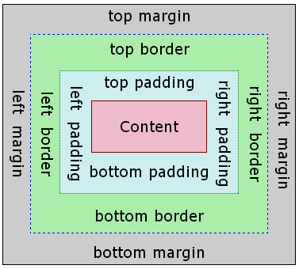
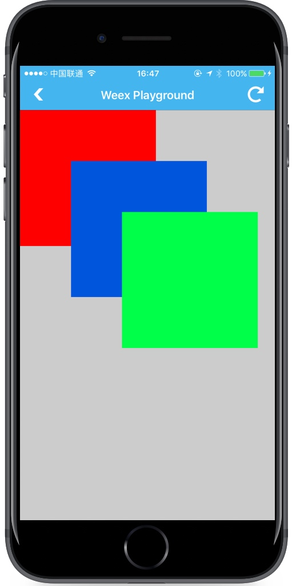

# 通用样式

所有 Weex 组件都支持以下通用样式规则。

## 盒模型



Weex 盒模型基于 [CSS 盒模型](https://www.w3.org/TR/css3-box/)，每个 Weex 元素都可视作一个盒子。我们一般在讨论设计或布局时，会提到「盒模型」这个概念。

盒模型描述了一个元素所占用的空间。每一个盒子有四条边界：外边距边界 margin edge, 边框边界 border edge, 内边距边界 padding edge 与内容边界 content edge。这四层边界，形成一层层的盒子包裹起来，这就是盒模型大体上的含义。

**注意：**
Weex 对于长度值目前只支持*像素*值，不支持相对单位（`em`、`rem`）。

- `width {length}`：，默认值 0
- `height {length}`：，默认值 0
- `padding {length}`：内边距，内容和边框之间的距离。默认值 0

  可有如下写法：

  - `padding-left {length}`：，默认值 0
  - `padding-right {length}`：，默认值 0
  - `padding-top {length}`：，默认值 0
  - `padding-bottom {length}`：，默认值 0
- `margin`：

  外边距，元素和元素之间的空白距离。值类型为 length，默认值 0

  可有如下写法：
  
  - `margin-left {length}`：，默认值 0
  - `margin-right {length}`：，默认值 0
  - `margin-top {length}`：，默认值 0
  - `margin-bottom {length}`：，默认值 0
- border：
  
  设定边框，`border` 目前不支持类似这样 `border: 1 solid #ff0000;` 的组合写法。

  可有如下写法：
  
  - `border-style`：

    设定边框样式，值类型为 string，可选值为 `solid` | `dashed` | `dotted`，默认值 `solid`

    可有如下写法：
  
    - `border-left-style {string}`：可选值为 `solid` | `dashed` | `dotted`，默认值 `solid`
    - `border-top-style {string}`：可选值为 `solid` | `dashed` | `dotted`，默认值 `solid`
    - `border-right-style {string}`：可选值为 `solid` | `dashed` | `dotted`，默认值 `solid`
    - `border-bottom-style {string}`：可选值为 `solid` | `dashed` | `dotted`，默认值 `solid`

  - `border-width {length}`：
  
    设定边框宽度，非负值, 默认值 0

    可有如下写法：
  
    - `border-left-width {length}`：，非负值, 默认值 0
    - `border-top-width {length}`：，非负值, 默认值 0
    - `border-right-width {length}`：，非负值, 默认值 0
    - `border-bottom-width {length}`：，非负值, 默认值 0

  - `border-color {color}`：
  
    设定边框颜色，默认值 `#000000`
  
    可有如下写法：
  
    - `border-left-color {color}`：，默认值 `#000000`
    - `border-top-color {color}`：，默认值 `#000000`
    - `border-right-color {color}`：，默认值 `#000000`
    - `border-bottom-color {color}`：，默认值 `#000000`
  - `border-radius {length}`：

    设定圆角，默认值 0

    可有如下写法：
  
    - `border-bottom-left-radius {length}`：，非负值, 默认值 0
    - `border-bottom-right-radius {length}`：，非负值, 默认值 0
    - `border-top-left-radius {length}`：，非负值, 默认值 0
    - `border-top-right-radius {length}`：，非负值, 默认值 0


注意：目前在 `<image>` 和 `<text>` 组件上尚无法只定义一个或几个角的 `border-radius`。比如你无法在这两个组件上使用 `border-top-left-radius`。

Weex 盒模型的 `box-sizing` 默认为 `border-box`，即盒子的宽高包含内容、内边距和边框的宽度，不包含外边距的宽度。

### 示例：

```html
<template>
  <div>
    <image  style="width: 400px; height: 200px; margin-left: 20px;" src="https://g.alicdn.com/mtb/lab-zikuan/0.0.18/weex/weex_logo_blue@3x.png"></image>
  </div>
</template>
```

## Flexbox

Weex 布局模型基于 CSS [`Flexbox`](http://www.w3.org/TR/css3-flexbox/)，以便所有页面元素的排版能够一致可预测，同时页面布局能适应各种设备或者屏幕尺寸。

Flexbox 包含 flex 容器和 flex 成员项。如果一个 Weex 元素可以容纳其他元素，那么它就成为 flex 容器。需要注意的是，flexbox 的老版规范相较新版有些出入，比如是否能支持 wrapping。这些都描述在 W3C 的工作草案中了，你需要注意下新老版本之间的不同。另外，老版本只在安卓 4.4 版以下得到支持。

### Flex 容器

在 Weex 中，Flexbox 是默认且唯一的布局模型，所以你不需要手动为元素添加 `display: flex;` 属性。

- `flex-direction`：

  定义了 flex 容器中 flex 成员项的排列方向。可选值为 `row` | `column`，默认值为 `column`

   - `column`：从上到下排列。
   - `row`：从左到右排列。

- `justify-content`：

  定义了 flex 容器中 flex 成员项在主轴方向上如何排列以处理空白部分。可选值为 `flex-start` | `flex-end` | `center` | `space-between`，默认值为 `flex-start`。

  - `flex-start`：是默认值，所有的 flex 成员项都排列在容器的前部；
  - `flex-end`：则意味着成员项排列在容器的后部；
  - `center`：即中间对齐，成员项排列在容器中间、两边留白；
  - `space-between`：表示两端对齐，空白均匀地填充到 flex 成员项之间。

  

-  `align-items`：

  定义了 flex 容器中 flex 成员项在纵轴方向上如何排列以处理空白部分。可选值为 `stretch` | `flex-start` | `center` | `flex-end`，默认值为 `stretch`。

  - `stretch` 是默认值，即拉伸高度至 flex 容器的大小；
  - `flex-start` 则是上对齐，所有的成员项排列在容器顶部；
  - `flex-end` 是下对齐，所有的成员项排列在容器底部；
  - `center` 是中间对齐，所有成员项都垂直地居中显示。

  

### Flex 成员项

flex 属性定义了 flex 成员项可以占用容器中剩余空间的大小。如果所有的成员项设置相同的值 `flex: 1`，它们将平均分配剩余空间. 如果一个成员项设置的值为 `flex: 2`，其它的成员项设置的值为 `flex: 1`，那么这个成员项所占用的剩余空间是其它成员项的2倍。

- `flex {number}`：值为 number 类型。

### 示例

一个简单的网格布局。


```html
<template>
  <div>
    <div v-for="(v, i) in list" class="row">
      <div v-for="(text, k) in v" class="item">
        <div>
          <text>{{text}}</text>
        </div>
      </div>
    </div>
  </div>
</template>
<style scoped>
  .item{
    flex:1;
    justify-content: center;
    align-items:center;
    border-width:1;
  }
  .row{
    flex-direction: row;
    height:80px;
  }
</style>
<script>
  module.exports = {
    data: function () {
      return {
        list:[
          ['A', 'B', 'C'],
          ['D', 'E', 'F'],
          ['G', 'H', 'I']
        ]
      }
    }
  }
</script>
```

一个在相对于屏幕水平居中，全屏居中的 `<div>`。

```html
<template>
  <div class="wrapper">
    <div class="box">
    </div>
  </div>
</template>

<style scoped>
  .wrapper {
    position: absolute;
    top: 0;
    right: 0;
    bottom: 0;
    left: 0;
    background-color: #cccccc;
    justify-content: center;
    align-items: center;
  }
  .box {
    width: 200px;
    height: 200px;
    background-color: #fc0000;
  }
</style>
```

## 定位

Weex 支持 `position` 定位，用法与 CSS position 类似。为元素设置 `position` 后，可通过 `top`、`right`、`bottom`、`left` 四个属性设置元素坐标。

- `position {string}`：
  
  设置定位类型。可选值为 `relative` | `absolute` | `fixed` | `sticky`，默认值为 `relative`。

  - `relative` 是默认值，指的是相对定位；
  - `absolute` 是绝对定位，以元素的容器作为参考系；
  - `fixed` 保证元素在页面窗口中的对应位置显示；
  - `sticky` 指的是仅当元素滚动到页面之外时，元素会固定在页面窗口的顶部。
- `top {number}`：距离上方的偏移量，默认为 0。
- `bottom {number}`：距离下方的偏移量，默认为 0。
- `left {number}`：距离左方的偏移量，默认为 0。
- `right {number}`：距离右方的偏移量，默认为 0。

**注意：**

1. Weex 目前不支持 `z-index` 设置元素层级关系，但靠后的元素层级更高，因此，对于层级高的元素，可将其排列在后面。
2. 如果定位元素超过容器边界，在 Android 下，超出部分将**不可见**，原因在于 Android 端元素 `overflow` 默认值为 `hidden`，但目前 Android 暂不支持设置 `overflow: visible`。 

### 示例



```html
<template scoped>
  <div class="wrapper">
    <div class="box box1">
    </div>
    <div class="box box2">
    </div>
    <div class="box box3">
    </div>
  </div>
</template>

<style>
  .wrapper {
    position: absolute;
    top: 0;
    right: 0;
    bottom: 0;
    left: 0;
    background-color: #cccccc;
  }
  .box {
    width: 400px;
    height: 400px;
    position: absolute;
  }
  .box1 {
    top: 0;
    left: 0;
    background-color: #ff0000;
  }
  .box2 {
    top: 150px;
    left: 150px;
    background-color: #0055dd;
  }
  .box3 {
    top: 300px;
    left: 300px;
    background-color: #00ff49;
  }
</style>
```

## 伪类 <span class="api-version">v0.9.5+</span>

Weex 支持四种伪类：`active`, `focus`, `disabled`, `enabled`

所有组件都支持 `active`, 但只有 `input` 组件和 `textarea` 组件支持 `focus`, `enabled`, `diabled`。

### 规则

- 同时生效生效的时候，优先级高覆盖优先级低

   - 例如：`input:active:enabled` 和 `input:active` 同时生效，前者覆盖后者

- 互联规则如下所示

  

### Example

```html
<template>
  <div class="wrapper">
    <image :src="logoUrl" class="logo"></image>
  </div>
</template>

<style scoped>
  .wrapper {
    align-items: center; 
    margin-top: 120px;
  }
  .title {
    font-size: 48px;
  }
  .logo {
    width: 360px; 
    height: 82px;
    background-color: red;
  }
  .logo:active {
    width: 180px; 
    height: 82px;
    background-color: green;
  }
</style>

<script>
  export default {
    props: {
      logoUrl: {
        default: 'https://alibaba.github.io/weex/img/weex_logo_blue@3x.png'
      },
      target: {
        default: 'World'
      }
    },
    methods: {
      update (e) {
        this.target = 'Weex';
      }
    }
  };
</script>
```

[试一下](http://dotwe.org/vue/df2c8f254620d6d30d0906ee75fe5b99)

## 线性渐变 <span class="api-version">v0.10+</span>

Weex 支持线性渐变背景，具体介绍可参考 [W3C description of the gradient](https://developer.mozilla.org/en-US/docs/Web/CSS/CSS_Images/Using_CSS_gradients)。

所有组件均支持线性渐变。

### 使用

 你可以通过 `background-image` 属性创建线性渐变。

```css
background-image: linear-gradient(to top,#a80077,#66ff00);
```

目前暂不支持 `radial-gradient`（径向渐变）。

Weex 目前只支持两种颜色的渐变，渐变方向如下：

* to right
  从左向右渐变
* to left
  从右向左渐变
* to bottom
  从上到下渐变
* to top
  从下到上渐变
* to bottom right
  从左上角到右下角
* to top left
  从右下角到左上角

### Note

- `background-image` 优先级高于 `background-color`，这意味着同时设置 `background-image` 和 `background-color`，`background-color` 被覆盖。
- 不要使用 `background` 简写.

### 示例

```html
<template>
  <scroller style="background-color: #3a3a3a">
    <div class="container1" style="background-image:linear-gradient(to right,#a80077,#66ff00);">
      <text class="direction">to right</text>
    </div>
    <div class="container1" style="background-image:linear-gradient(to left,#a80077,#66ff00);">
      <text class="direction">to left</text>
    </div>
    <div class="container1" style="background-image:linear-gradient(to bottom,#a80077,#66ff00);">
      <text class="direction">to bottom</text>
    </div>
    <div class="container1" style="background-image:linear-gradient(to top,#a80077,#66ff00);">
      <text class="direction">to top</text>
    </div>
    <div style="flex-direction: row;align-items: center;justify-content: center">
      <div class="container2" style="background-image:linear-gradient(to bottom right,#a80077,#66ff00);">
        <text class="direction">to bottom right</text>
      </div>
      <div class="container2" style="background-image:linear-gradient(to top left,#a80077,#66ff00);">
        <text class="direction">to top left</text>
      </div>
    </div>
  </scroller>
</template>
<style>
  .container1 {
    margin: 10px;
    width: 730px;
    height: 200px;
    align-items: center;
    justify-content: center;
    border: solid;
    border-radius: 10px;
  }

  .container2 {
    margin: 10px;
    width: 300px;
    height: 300px;
    align-items: center;
    justify-content: center;
    border: solid;
    border-radius: 10px;
  }

  .direction {
    font-size: 40px;
    color: white;
  }
</style>
```

## 其他基本样式

- `opacity {number}`：取值范围为 [0, 1] 区间。默认值是 1，即完全不透明；0 是完全透明；0.5 是 50% 的透明度。
- `background-color {color}`：设定元素的背景色，可选值为色值，支持RGB（ `rgb(255, 0, 0)` ）；RGBA（ `rgba(255, 0, 0, 0.5)` ）；十六进制（ `#ff0000` ）；精简写法的十六进制（ `#f00` ）；色值关键字（`red`），默认值是 `transparent` 。

**注意：** [色值的关键字列表](./color-names.html)。

## 上手样式

如果对于样式写法需要更多上手参考，可参考每个组件的文档中，都有常见的例子可供参考。

你可以按照以下步骤来规划 Weex 页面的样式。

1. 全局样式规划：将整个页面分割成合适的模块。
2. flex 布局：排列和对齐页面模块。
3. 定位盒子：定位并设置偏移量。
4. 细节样式处理：增加特定的具体样式。
