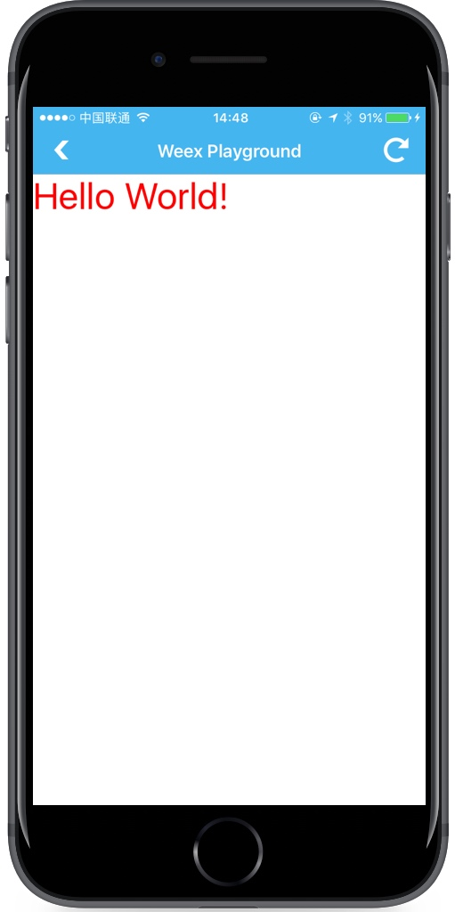

# &lt;div&gt;

`<div>` 组件是用于包装其它组件的最基本容器。支持所有的通用样式、特性、`flexbox` 布局。其类似于 HTML 的 `<div>` 容器，但**不能**直接在里面添加文本（字符串），如果要展示文本，应该使用 `<text>` 组件。历史版本中，`<div>` 别名是 `<container>`，目前**已经弃用**。

**注意：**

`<div>` 嵌套层级不可过深，否则容易引起性能问题，建议控制在 **10** 层以内。

一个简单例子：

```html
<template>
  <div>
    <text class="text">Hello World!</text>
  </div>
</template>

<style>
.text {
  font-size: 70;
  color: #ff0000
}
</style>

<script></script>
```

[体验一下](http://dotwe.org/a468998152ee680413588c38bd61c29e)



## 子组件

`<div>` 基本容器组件，因此支持包括 `<div>` 在内的任何组件作为自己的子组件。因此，在写一个组件时，推荐外层使用 `<div>` 作为根容器。

## 样式

`<div>` 支持所有通用样式：

- 盒模型
- `flexbox` 布局
- `position`
- `opacity`
- `background-color`

查看 [组件通用样式](../common-style.html)

## 事件

`<div>` 支持所有通用事件：

- `click`
- `longpress`
- `appear`
- `disappear`

查看 [通用事件](../common-event.html)

## 约束

1. **不能**直接在 `<div>` 中添加文本。

  错误示例，“Hello World!” 无法被正常渲染。

  ```html
  <template>
    <div>Hello World!</div>
  </template>

  <style>
  .text {
    font-size: 70;
    color: #ff0000
  }
  </style>

  <script></script>
  ```

  [体验一下](http://dotwe.org/3ef3ba3f0f162b27e24c525250c46a04)

2. `<div>` 不可滚动，即使显式设置高度也一样。

  [错误示例](http://dotwe.org/a2cc491c5b9e6f6eb06795e45e725efd)

## 示例

```html
<template>
  <div>
    <div class="box"></div>
  </div>
</template>

<style scoped>
  .box {
    border-width: 2px;
    border-style: solid;
    border-color: #BBB;
    width: 250px;
    height: 250px;
    margin-top: 250px;
    margin-left: 250px;
    background-color: #EEE;
  }
</style>
```

[try it](../../../examples/div.html)
