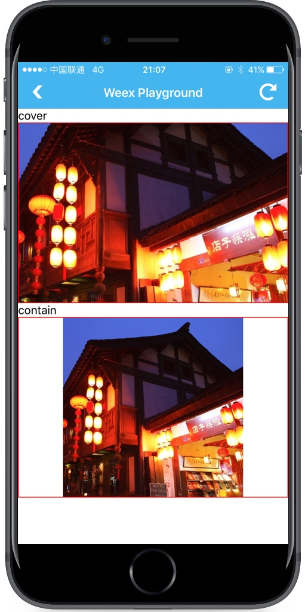

# &lt;image&gt;

`<image>` 组件用于渲染图片，并且它不能包含任何子组件。可以用 `` 作简写。

需要注意的是，需要明确指定 `width` 和 `height`，否则图片无法显示。

简单例子：

```html
<template>
  <div>
    </img>
  </div>
</template>
```

[体验一下](http://dotwe.org/23b6cf951e6059d2cf7b9a74a9915ace)

## 子组件

`<image>` 组件不支持任何子组件，因此不要尝试在 `<image>` 组件中添加任何组件。如果需要实现 `background-image` 的效果，可以使用 `<image>` 组件和 `position` 定位来现实，如下面代码。

```html
<template>
  <div>
    </img>
    <div class="title">
      <text style="font-size:50; color: #ff0000">你好，image</text>
    </div>
  </div>
</template>
<style>
  .title{
    position:absolute;
    top:50;
    left:10;
  }
</style>
```

[体验一下](http://dotwe.org/08dd49aaca8bf289c5fc08f808b9c08c)

## 特性

`<image>` 组件，包含 `src` 和 `resize` 两个重要特性。

- `src {string}`：定义图片链接，目前图片暂不支持本地图片。
- `resize {string}`：可以控制图片的拉伸状态，值行为和 W3C 标准一致。

  可选值为：

  - `stretch`：默认值，指定图片按照容器拉伸，有可能使图片产生形变。
  - `cover`：指定图片可以被调整到容器，以使图片完全覆盖背景区域，图片有可能被剪裁。
  - `contain`：指定可以不用考虑容器的大小，把图像扩展至最大尺寸，以使其宽度和高度完全适应内容区域。

  例子：

  

- `placeholder`: <span class="api-version">v0.9+</span> &lt;string&gt; 当源图片下载中时显示一张占位图。

  [体验一下](http://dotwe.org/049213ab3364a86637e211c0329cdc50)

## 样式

- 通用样式：支持所有通用样式

  - 盒模型
  - `flexbox` 布局
  - `position`
  - `opacity`
  - `background-color`

  查看 [组件通用样式](../common-style.html)

## 事件

- `load`: <sup class="api-version">v0.8+</sup>：当图片加载完成时触发。目前在 Android、iOS 上支持，H5 暂不支持。[示例](http://dotwe.org/25bd347da6a59603dd31ec057d2691da)

  - 事件对象
    - `success`: 当图片成功加载时为`true`，否则为`false`
    - `size`: 图片的原始尺寸，包含两个参数：`naturalWidth` 代表图片的原始宽度像素值，`naturalHeight` 代表图片的原始高度值。这两个参数的默认值都为`0`

- 通用事件

  支持所有通用事件：

  - `click`
  - `longpress`
  - `appear`
  - `disappear`

  查看 [通用事件](../common-event.html)

## 约束

1. 需要指定宽高；
2. 不支持子组件。

## 示例

```html
<template>
  <scroller class="wrapper" >
    <div class="page-head" >
      <image class="title-bg" resize="cover" src="https://img.alicdn.com/tps/TB1dX5NOFXXXXc6XFXXXXXXXXXX-750-202.png"></image>
      <div class="title-box">
        <text class="title">Alan Mathison Turing</text>
      </div>
    </div>
    <div class="article">
      <text class="paragraph">Alan Mathison Turing ( 23 June 1912 – 7 June 1954) was an English computer scientist, mathematician, logician, cryptanalyst and theoretical biologist. He was highly influential in the development of theoretical computer science, providing a formalisation of the concepts of algorithm and computation with the Turing machine, which can be considered a model of a general purpose computer.Turing is widely considered to be the father of theoretical computer science and artificial intelligence.</text>
      <text class="paragraph">During the Second World War, Turing worked for the Government Code and Cypher School (GC&CS) at Bletchley Park, Britain's codebreaking centre. For a time he led Hut 8, the section responsible for German naval cryptanalysis. He devised a number of techniques for speeding the breaking of German ciphers, including improvements to the pre-war Polish bombe method, an electromechanical machine that could find settings for the Enigma machine. Turing played a pivotal role in cracking intercepted coded messages that enabled the Allies to defeat the Nazis in many crucial engagements, including the Battle of the Atlantic; it has been estimated that this work shortened the war in Europe by more than two years and saved over fourteen million lives.</text>
      <text class="paragraph">After the war, he worked at the National Physical Laboratory, where he designed the ACE, among the first designs for a stored-program computer. In 1948 Turing joined Max Newman's Computing Machine Laboratory at the Victoria University of Manchester, where he helped develop the Manchester computers and became interested in mathematical biology. He wrote a paper on the chemical basis of morphogenesis, and predicted oscillating chemical reactions such as the Belousov–Zhabotinsky reaction, first observed in the 1960s.</text>
      <text class="paragraph">Turing was prosecuted in 1952 for homosexual acts, when by the Labouchere Amendment, "gross indecency" was still criminal in the UK. He accepted chemical castration treatment, with DES, as an alternative to prison. Turing died in 1954, 16 days before his 42nd birthday, from cyanide poisoning. An inquest determined his death as suicide, but it has been noted that the known evidence is also consistent with accidental poisoning. In 2009, following an Internet campaign, British Prime Minister Gordon Brown made an official public apology on behalf of the British government for "the appalling way he was treated." Queen Elizabeth II granted him a posthumous pardon in 2013.</text>
    </div>
  </scroller>
</template>

<style>
  .page-head {
    width: 750px;
    height: 200px;
  }
  .title-bg {
    width: 750px;
    height: 200px;
  }
  .title-box {
    width: 750px;
    height: 200px;
    justify-content: center;
    align-items: center;
    position: absolute;
    top: 0;
    right: 0;
    bottom: 0;
    left: 0;
  }
  .title {
    color: #ffffff;
    font-size: 32px;
    font-weight: bold;
  }
  .article {
    padding: 20px;
  }
  .paragraph{
    margin-bottom: 15px;
  }
</style>
```

[try it](../../../examples/image.html)
