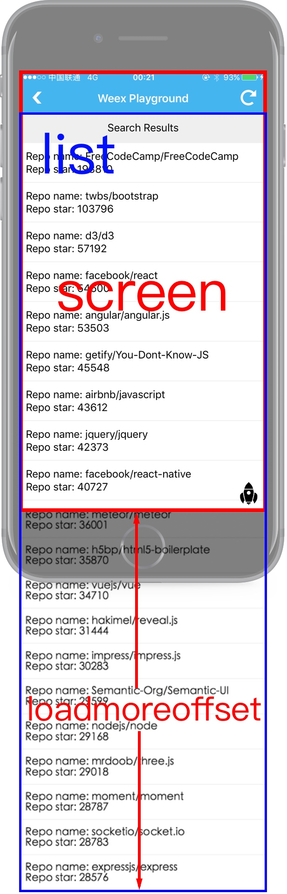

# &lt;list&gt;

`<list>` 组件是提供垂直列表功能的核心组件，拥有平滑的滚动和高效的内存管理，非常适合用于长列表的展示。最简单的使用方法是在 `<list>` 标签内使用一组由简单数组 `repeat` 生成的 `<cell>` 标签填充。

## 子组件

`<list>` 组件支持更多高级功能，由以下子组件提供：

- `<cell>`

  用于定义列表中的子列表项，类似于 HTML 中的 `ul` 之于 `li`。Weex 会对 `<cell>` 进行高效的内存回收以达到更好的性能。

  使用文档请查看 [`<cell>`](./cell.html)。

- `header` <sup class="wx-v">0.6.1+</sup>

  当 `<header>` 到达屏幕顶部时，吸附在屏幕顶部。

- `<refresh>`

  用于给列表添加下拉刷新的功能。

  使用文档请查看 [`<refresh>`](./refresh.html)

- `<loading>`

  `<loading>` 用法与特性和 `<refresh>` 类似，用于给列表添加上拉加载更多的功能。

  使用文档请查看 [`<loading>`](./loading.html)

**注意：**

`<list>` 的子组件只能包括以上四种组件或是 `fix` 定位的组件，其他形式的组件将不能被正确的渲染。

## 特性

- `loadmoreoffset {number}`：默认值为 0，触发 `loadmore` 事件所需要的垂直偏移距离（设备屏幕底部与 `<list>` 底部之间的距离）。当 `<list>` 的滚动条滚动到足够接近 `<list>` 底部时将会触发 `loadmore` 这个事件。

  

## 样式

- 通用样式：支持所有通用样式

  - 盒模型
  - `flexbox` 布局
  - `position`
  - `opacity`
  - `background-color`

  查看 [组件通用样式](../common-style.html)

## 事件

- `loadmore` <sup class="wx-v">0.5+</sup>：如果列表滚动到底部将会立即触发这个事件，你可以在这个事件的处理函数中加载下一页的列表项。

  [体验一下](http://dotwe.org/bc445ede8746a31360e3607d210304c5)

- 通用事件

  支持所有通用事件：

  - `click`
  - `longpress`
  - `appear`
  - `disappear`

  查看 [通用事件](../common-event.html)

## 扩展

### scrollToElement(node, options)

滚动到列表某个指定项是常见需求，`<list>` 拓展了该功能支持滚动到指定 `<cell>`。通过 `dom` module 访问，更多信息可参考 [dom module](../modules/dom.html) 。

#### 参数

- `node {node}`：指定目标节点。
- `options {Object}`：
  - `offset {number}`：一个到其可见位置的偏移距离，默认是 0

## 约束

1. **不允许**相同方向的 `<list>` 或者 `<scroller>` 互相嵌套，换句话说就是嵌套的 `<list>`/`<scroller>` 必须是不同的方向。

  举个例子，**不允许**一个垂直方向的 `<list>` 嵌套的一个垂直方向的 `<scroller>` 中，但是一个垂直方向的 `<list>` 是可以嵌套的一个水平方向的 list 或者 `<scroller>` 中的。

2. `<list>` 为根节点时无需设置高度，但是内嵌 `<list>` 高度**必须可计算**，你可以使用 `flex` 或 `postion` 将 `<list>` 设为一个响应式高度（例如全屏显示）, 也可以显式设置 `<list>` 组件的 `height` 样式。

## 示例


```html
<template>
  <list class="list" @loadmore="fetch" loadmoreoffset="10">
    <cell class="cell" v-for="num in lists">
      <div class="panel">
        <text class="text">{{num}}</text>
      </div>
    </cell>
  </list>
</template>

<script>
  const modal = weex.requireModule('modal')
  const LOADMORE_COUNT = 4

  export default {
    data () {
      return {
        lists: [1, 2, 3, 4, 5]
      }
    },
    methods: {
      fetch (event) {
        modal.toast({ message: 'loadmore', duration: 1 })

        setTimeout(() => {
          const length = this.lists.length
          for (let i = length; i < length + LOADMORE_COUNT; ++i) {
            this.lists.push(i + 1)
          }
        }, 800)
      }
    }
  }
</script>

<style scoped>
  .panel {
    width: 600px;
    height: 250px;
    margin-left: 75px;
    margin-top: 35px;
    margin-bottom: 35px;
    flex-direction: column;
    justify-content: center;
    border-width: 2px;
    border-style: solid;
    border-color: rgb(162, 217, 192);
    background-color: rgba(162, 217, 192, 0.2);
  }
  .text {
    font-size: 50px;
    text-align: center;
    color: #41B883;
  }
</style>
```

[try it](../../../examples/list.html)
