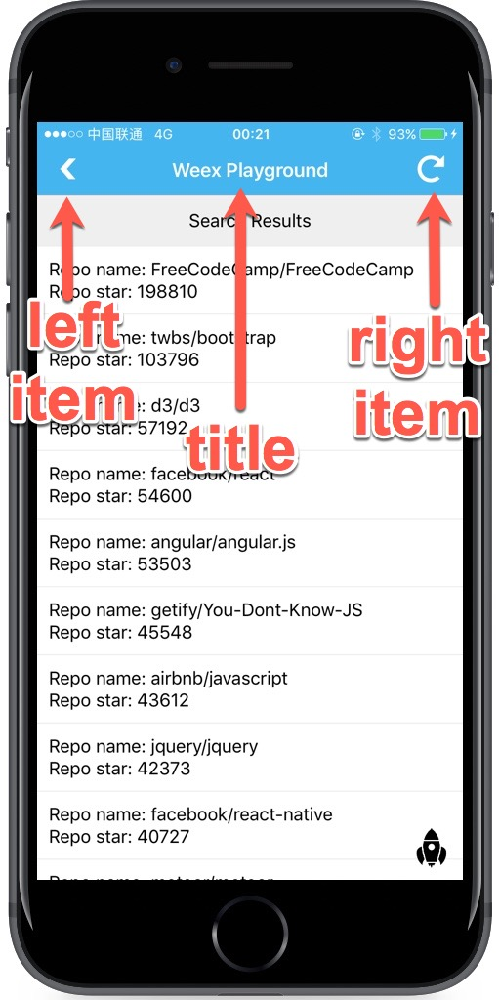

# &lt;wxc-navpage&gt; <sup>(v0.5+)</sup>

`<wxc-navpage>` 组件是一个包含 navbar 的容器组件，可以根据业务场景定制 navbar 组件。同时，可以使用 `navigator` 模块控制页面的跳转，具体参考 [`navigator module`](../modules/navigator.html)。一般情况，都是配合 navbar 组件使用。如果不了解 navigator 相关知识，建议先了解下 iOS 或者 Android 的相关组件。在 H5 上，其实是相当于导航栏。

用法：在 `script` 标签中通过一个 `require` 语句引入，即：`require('weex-components');`

**示例**

```html
<template>
  <div style="flex-direction: column;">
    <wxc-navpage tab-items = {{tabItems}}></wxc-navpage>
  </div>
</template>

<script>
  require('weex-components');
  // more
</script>
```

在 `require('weex-components');` 之前 ，需要在工程目录下执行以下命令：

```bash
npm install weex-components
```

## 子组件

`<wxc-navpage>` 组件支持任意 Weex 组件。

## 特性

`<wxc-navpage>` 组件的特性其实是对 navbar 进行功能设置，如下图所示，是 navbar 的一个简单示意。



- `height {number}`：navbar 的高度，默认是 88。

- `background-color {color}`：navbar 的背景颜色，默认是白色。

- `title {string}`：navbar 的标题。

- `title-color {color}`：navbar 标题的颜色，默认黑色。

- `left-item-title {string}`：navbar 左侧按钮的标题。

- `left-item-color {color}`：navbar 左侧按钮标题颜色，默认黑色。

- `right-item-title {string}`：navbar 右侧按钮标题。

- `right-item-color {color}`：navbar 右侧按钮标题颜色，默认黑色。

- `left-item-src {string}`：navbar 左侧按钮的图标。

- `right-item-src {string}`：navbar 右侧按钮的图标。

### 样式

- 通用样式：支持所有通用样式

  - 盒模型
  - `flexbox` 布局
  - `position`
  - `opacity`
  - `background-color`

  查看 [组件通用样式](../common-style.html)

## 事件

`<wxc-navpage>` 组件支持左右两项点击事件。

- `naviBar.leftItem.click`: 当 navbar 的左侧按钮被点击时触发事件，需要在 `created` 时期注册事件。
- `naviBar.rightItem.click`: 当 navbar 的右侧按钮被点击时触发事件，需要在 `created` 时期注册事件。

**示例：**

```html
<template>
  <wxc-navpage height={{...}} background-color="..." title="..." title-color="..." left-item-title="..." left-item-color="..." right-item-src="...">
    <content> ...</content>
  </wxc-navpage>
</template>
<script>
  require('weex-components');
  module.exports = {
    created: function() {
      this.$on('naviBar.rightItem.click',function(e){
        //handle your click event here.
      });

      this.$on('naviBar.leftItem.click',function(e){
        //handle your click event here. 
      });
    }
  }
</script>
```

- 通用事件

  支持所有通用事件：

  - `click`
  - `longpress`
  - `appear`
  - `disappear`

  查看 [通用事件](../common-event.html)

## 示例

**注意：**

[dotwe](http://dotwe.org) 平台暂不支持 `wxc-xxx` 类型的组件。

```html
<template>
  <wxc-navpage data-role="none" height={{navBarHeight}} background-color="#ff5898" title={{title}} title-color="white" left-item-title="More" left-item-color="white" right-item-src="http://gtms02.alicdn.com/tps/i2/TB1ED7iMpXXXXXEXXXXWA_BHXXX-48-48.png">
    <wxc-panel title="push a new page">
      <wxc-button type="primary" size="small" value="push" onclick="push"></wxc-button>
    </wxc-panel>
    <wxc-panel title="pop to the last page">
      <wxc-button type="success" size="small" value="pop" onclick="pop"></wxc-button>
    </wxc-panel>
  </wxc-navpage>
</template>

<script>
  require('weex-components');
  module.exports = {
    data: {
      navBarHeight: 88,
      title: 'Navigator',
      dir: 'examples',
      baseURL: '',
    },
    created: function() {
      this.$getConfig(function (config) {
        var env = config.env;
        if(env.platform == 'iOS'){
          var scale = env.scale;
          var deviceWidth = env.deviceWidth / scale;
          this.navBarHeight = 64.0 * 750.0 / deviceWidth;
        }
      }.bind(this));

      this.$on('naviBar.rightItem.click',function(e){
        duration = 2;
        this.$call('modal', 'toast', {
          'message': 'naviBar.rightItem.click',
          'duration': duration
          });
      });

      this.$on('naviBar.leftItem.click',function(e){
        duration = 2;
        this.$call('modal', 'toast', {
          'message': 'naviBar.leftItem.click',
          'duration': duration
          });
      });
    },
    methods: {
      push: function() {
        var vm = this;
        var params = {
          'url':  'http://dotwe.org/raw/dist/33dfcbe81979c60ba5de72c235d7d0f8.js',
          'animated' : 'true',
        }
        vm.$call('navigator','push',params, function () {});
      },

      pop: function() {
        var vm = this;
        var params = {
          'animated' : 'true',
        }
        vm.$call('navigator','pop',params, function () {});
      }
    }
  }
</script>
```
