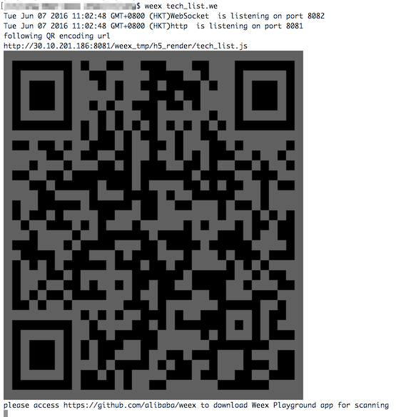
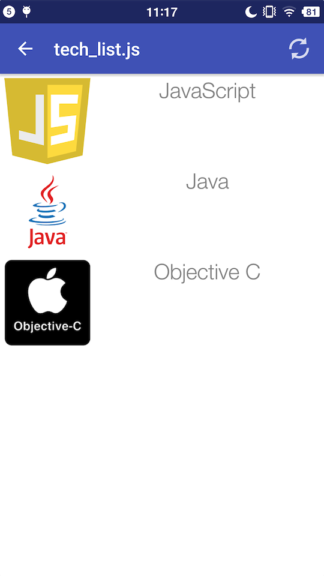
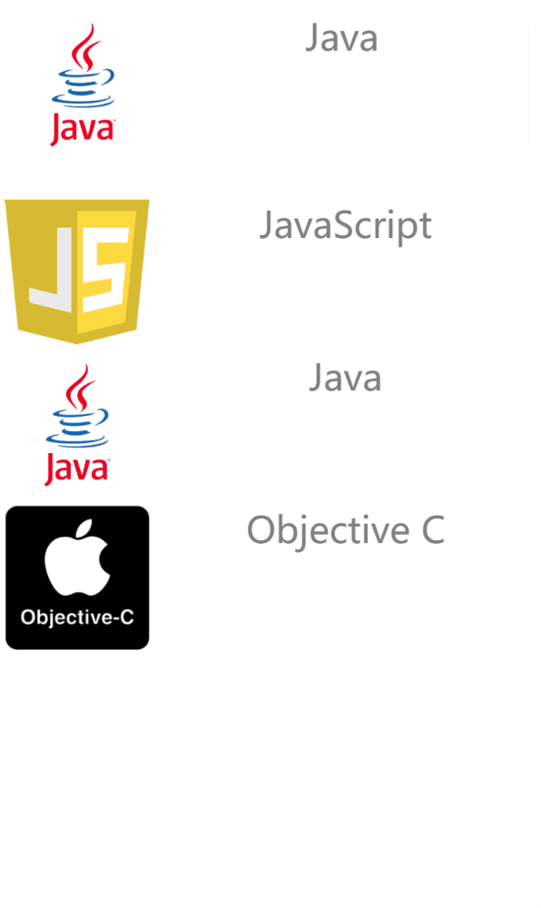

# Tutorial

<span class="weex-version">0.4</span>
<a href="https://github.com/weexteam/article/issues/4"  class="weex-translate">cn</a>

We will make a simple but realistic list, in which the technologies weex used will be shown. This form of list also works for a lot of e-commerce apps/mobile sites.

## Getting Started

Let's start easy though, making a item of list.

```html
<template>
  <div class="container">
    <div class="cell">
        <image class="thumb" src="http://t.cn/RGE3AJt"></image>
        <text class="title">JavaScript</text>
    </div>
  </div>
</template>

<style>
  .cell { margin-top: 10; margin-left: 10; flex-direction: row; }
  .thumb { width: 200; height: 200; }
  .title { text-align: center; flex: 1; color: grey; font-size: 50; }
</style>
```

You can copy and paste above code to a Weex file named `tech_list.we` (`.we` is our recommended the file extension name)

## Preview

First you need to install [Node](https://nodejs.org/en/download/stable/). Then you can install Weex CLI program  [Weex Toolkit](https://www.npmjs.com/package/weex-toolkit) with command:

```
npm install -g weex-toolkit
```

After the installation finished, you could ensure the Weex CLI is properly installed by typing `weex` on the command line. You should see the following help text displayed:

```
Usage: weex foo/bar/your_next_best_weex_script_file.we  [options]

Options:
  --qr     display QR code for native runtime, 
  -o,--output  transform weex we file to JS Bundle, output path (single JS bundle file or dir)
  -s,--server  start a http file server, weex .we file will be transforme to JS bundle on the server , specify local root path using the option  
  ......
  --help  Show help         
  -h, --host [default: "127.0.0.1"]
```

If all works well, navigate to the directory where you save the newly created `tech_list.we`, then type:

```
weex tech_list.we
```

A browser window will open automatically  to display  something like below     ( weex-toolkit version must greater then 0.1.0 , please check using `weex --version` cmd)


## Intro Weex Syntax

So it's time for introduce the syntax. As the content of `tech_list.we` showing, Weex source code is written in three parts -- *template*, *style*, *script* just like html,css,javascript for the Web.

Template is the skeleton that give weex structure, it composed by tags which surround content and apply meaning to it. Weex has two type of tag, opening tag & closing tag, we call every couple of opening tag & closing tag a Weex tag. Tag have *attributes*, different attribute have different meaning, class attribute makes it possible to define equal styles for multiple tags, onclick attribute makes the tag responds to click event.

Style describes how Weex tags are to be displayed. We like you, love the CSS, so we try to keep consistent with CSS standard as possible. Weex Style support a lot of CSS features, eg: margin, padding, fixed...... Better yet, flexbox layout (flex) is well supported in Weex Style.

Script add *data* & *logic* to Weex tags, help you easy access local or remote data and update tags. You can also define some methods for your tag to respond to different events. Weex Script organizing learn a lot from CommonJS module style.

More complete information about Weex syntax can be found in our [Syntax chapter](syntax/main.md).

## Add More Item

We can't call one item an list, so we need add more item to our tech list. open `tech_list.we` in your favorite editor and update it's content like below:

```html
<template>
  <div class="container">
    <div class="cell">
        <image class="thumb" src="http://t.cn/RGE3AJt"></image>
        <text class="title">JavaScript</text>
    </div>
    <div class="cell">
        <image class="thumb" src="http://t.cn/RGE3uo9"></image>
        <text class="title">Java</text>
    </div>
    <div class="cell">
        <image class="thumb" src="http://t.cn/RGE31hq"></image>
        <text class="title">Objective C</text>
    </div>
  </div>
</template>

<style>
  .cell{ margin-top:10 ; margin-left:10 ; flex-direction: row; }
  .thumb { width: 200; height: 200; }
  .title { text-align: center ; flex: 1; color: grey; font-size: 50; }
</style>
```

Now we will try to  render our  tech_list.we  with Weex native renderer.  Open your terminal and  navigate to the directory where you save the tech_list.we again, then type

```
weex tech_list.we --qr -h {ip or hostname}
```

It's ***RECOMMENDED*** to use `-h` option to specify your local ip address or hostname.

An QR code will be display in the terminal window like:



The QR code can work together with [Weex Playground App](http://alibaba.github.io/weex/download.html). Open it and tap the scan icon at the top-right corner, then scan the Qr code in your terminal.If all works well, a beautiful list will be displayed in your phone.



Here, I must stress that the list is rendered by native view ( not Webkit ), so your app get faster loading and less memory overhead than common Webview renderer.

Now open tech_list.we again and trying to change some text,after changes saved the Weex playground App will immediately display these changes. we called it **Hot-Reload**. Hope it can help you use Weex better.

## Add Build-in Component

Beyond writing basic tag by yourself, Weex provide a lot of build-in components. For example, Slider is common to many App/Mobile Web, So Weex include a build-in Slider and you can easily using the component in your script. Let's open tech_list.we and update it's content like below.

```html
<template>
  <div style="flex-direction: column;">
    <slider class="slider" interval="{{intervalValue}}" auto-play="{{isAutoPlay}}" >
      <div class="slider-pages" repeat="{{itemList}}" onclick="goWeexSite" >
        <image class="thumb" src="{{pictureUrl}}"></image>
        <text class="title">{{title}}</text>
      </div>
    </slider>

  <div class="container" onclick="goWeexSite" >
    <div class="cell">
        <image class="thumb" src="http://t.cn/RGE3AJt"></image>
        <text class="title">JavaScript</text>
    </div>
    <div class="cell">
        <image class="thumb" src="http://t.cn/RGE3uo9"></image>
        <text class="title">Java</text>
    </div>
    <div class="cell">
        <image class="thumb" src="http://t.cn/RGE31hq"></image>
        <text class="title">Objective C</text>
    </div>
  </div>
</template>

<style>
  .cell { margin-top:10 ; margin-left:10 ; flex-direction: row; }
  .thumb { width: 200; height: 200; }
  .title { text-align: center ; flex: 1; color: grey; font-size: 50; }
  .slider {
    margin: 18;
    width: 714;
    height: 230;
  }
  .slider-pages {
    flex-direction: row;
    width: 714;
    height: 200;
  }
</style>

<script>
module.exports = {
    data: {
      intervalValue:"1000",
      isShowIndicators:"true",
      isAutoPlay:"true",
      itemList: [
        {title: 'Java', pictureUrl: 'http://t.cn/RGE3uo9'},
        {title: 'Objective C', pictureUrl: 'http://t.cn/RGE31hq'},
        {title: 'JavaScript', pictureUrl: 'http://t.cn/RGE3AJt'}
      ]
    },
    methods: {
      goWeexSite: function () {
        this.$openURL('http://alibaba.github.io/weex/')
      }
    }
}
</script>
```

Open terminal and run the command again.

```
weex tech_list.we
```

You should see a slider prepend to our list.



More information about Slider Component can be found [here](components/slider.md).

Just as previous example, the slider can be rendering in native, easily in Weex playground,also in your App. Please refer [the document](advanced/integrate-to-android.md) for integrating Weex into your App.
